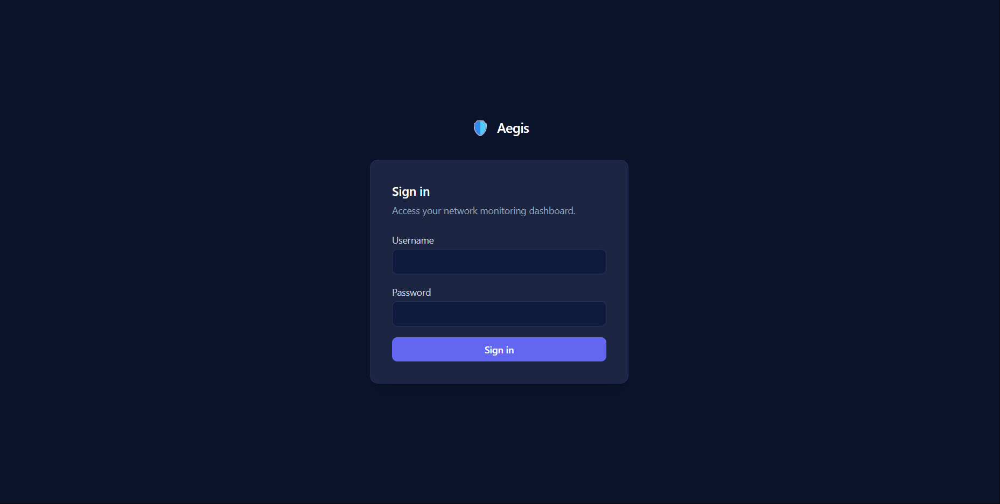
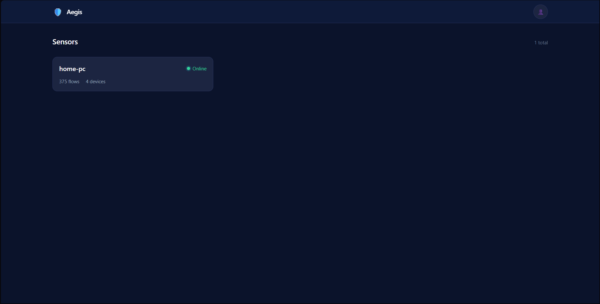
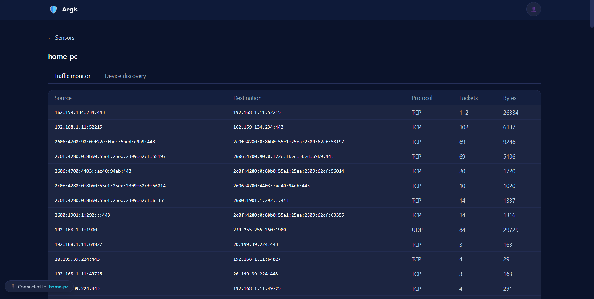
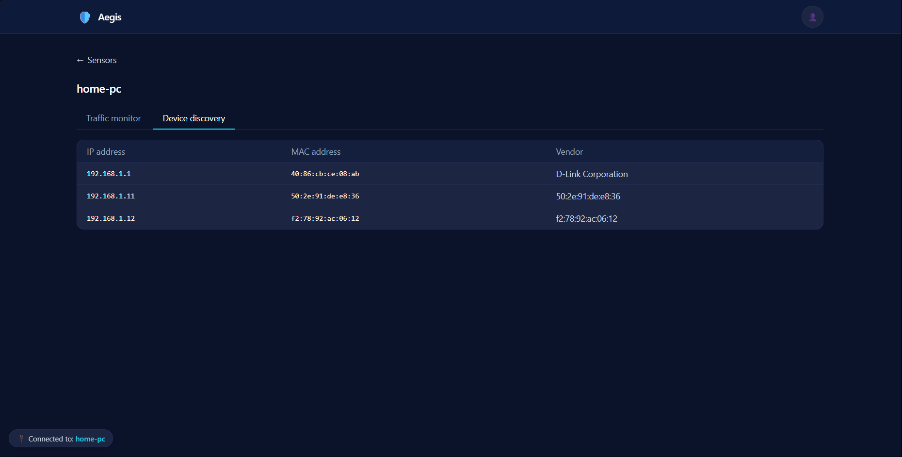

# 🛡️ Aegis

Managing network visibility today usually means paying for three or four separate tools — one for traffic analysis, one for device discovery, one for intrusion detection, one for cloud auditing. I built **Aegis** to combine all of that into a single self-hosted platform.

Aegis provides self-hosted network monitoring with live flow analysis and ARP-based device discovery, fronted by a single FastAPI app serving its own Tailwind dashboard (no separate frontend build, no CORS).

> **Developer Note:** This is my personal project built to learn distributed system monitoring and low-level packet capture workflows. I leveraged AI acceleration to help generate and polish the frontend dashboard code, styling components, and initial configuration structure, allowing me to focus on building a robust backend architecture.

---

## What it does today

* Captures live network traffic on the host machine (IPv4, IPv6, ARP, TCP, UDP, ICMP)
* Groups packets into flows — one line per (source, destination, port, protocol)
* Prunes idle flows automatically after a timeout
* Runs as a standalone sensor that ships flow snapshots over HTTP to a central Aegis server
* Server authenticates sensors with a shared API key
* Server tracks each sensor's status (online / offline) and displays them on a live overview page
* Click a sensor to open a per-sensor detail page with its current flows and discovered hardware devices
* Logs in with a secure password implementation (Argon2id hash + JWT session cookie)
* Produces structured logs (text for development, JSON for production)
* CI pipeline structure accommodates test automation and a bandit security scan on every push
* Pytest suite covering the login flow and the ingest endpoint

---

## Screenshots

### 🔑 Secure Login Gate


### 🖥️ Live Fleet Status


### 📊 Real-Time Network Conversations


### 🔍 Automated Subnet Mapping


---

## Project Layout

```text
aegis/
├── backend/
│   ├── app/
│   │   ├── main.py           # Routes, auth-guard middleware, ingest API
│   │   ├── config.py         # Environment-driven settings
│   │   ├── security.py       # Argon2id hashing + JWT sessions
│   │   ├── store.py          # In-memory sensor/flow/device store
│   │   └── templates/
│   │       └── index.html    # Login gate + dashboard (Single HTML template)
│   └── requirements.txt
├── screenshots/              # UI application images for repository documentation
├── sensors/
│   ├── run.py                # Scapy flow capture + periodic local ARP sweep
│   └── requirements.txt
├── .env.example
├── .gitignore
├── backend.Dockerfile
├── docker-compose.yml
└── sensor.Dockerfile
```

---

## Quickstart

1. Copy `.env.example` to `.env` and fill in real values — at minimum `ADMIN_PASSWORD`, `JWT_SECRET`, and matching `SENSOR_KEYS` / `SENSOR_KEY`.
2. `docker compose up --build`
3. Open `http://localhost:8000` and log in with `ADMIN_USERNAME` / `ADMIN_PASSWORD`.

The sensor container needs `network_mode: host` plus `NET_ADMIN`/`NET_RAW` capabilities to run real ARP sweeps and packet capture — that's already set in `docker-compose.yml`. Adjust `SUBNET` to match your actual LAN range.

---

## Notes on this rebuild

* **Storage is in-memory** (see `store.py`) to keep the rebuild self-contained. Flow/device snapshots reset on server restart — swap in Postgres/SQLite behind the same `Store` interface when you're ready to persist history.
* **Auth**: a single admin account, Argon2id-hashed, JWT session cookie (httponly, samesite=lax). If you don't set `ADMIN_PASSWORD`, the server generates one at startup and logs it once — check `docker compose logs backend`.
* **Sensor auth** is separate from user auth: each sensor sends `X-Sensor-Id` / `X-Sensor-Key` headers that must match an entry in the server's `SENSOR_KEYS` env var.
* Run more than one sensor by duplicating the `sensor` service in `docker-compose.yml` with a different `SENSOR_ID`/`SENSOR_KEY` per host.

---

## 🔮 Future Roadmap (Features to Add)

As Aegis scales from a baseline visibility platform into a small-scale **NDR (Network Detection and Response)** framework, the following capabilities are planned:

* **Persistence Layer:** Integrating SQLAlchemy and a SQLite/PostgreSQL layer behind the database engine to store long-term flow telemetry and device presence logs across server reboots.
* **Intrusion Detection System (IDS):** Monitoring data endpoints for suspicious patterns, tracking data exfiltration markers, and flagging **MAC Address Spoofing** or unknown rogue hardware nodes attaching to subnets.
* **Cloud Infrastructure Auditing:** Expanding ingestion hooks to retrieve metrics from AWS (EC2 mappings, VPC boundary metrics, and wide Open Security Groups) to flag vulnerable configurations directly in the control panel.
* **Advanced Analytics Dashboard:** Integrating time-series metrics via Prometheus and Grafana structures to chart data throughput rates and protocol splits visually.
