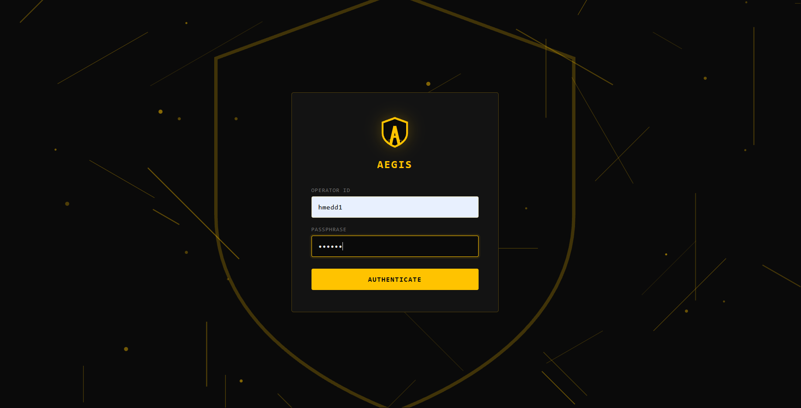
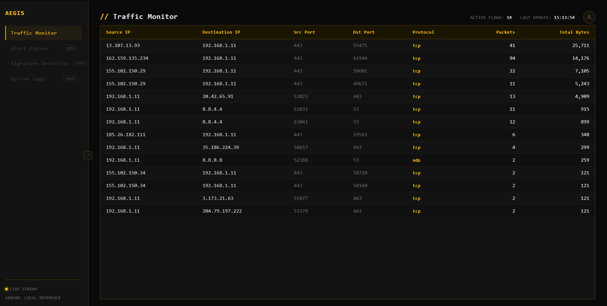
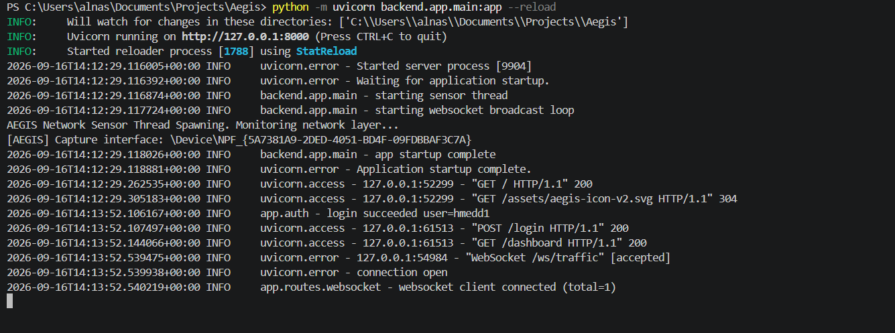
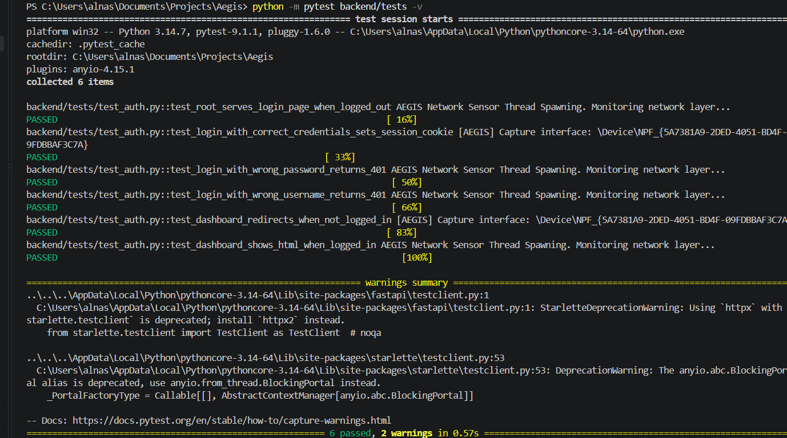

# Aegis

I built Aegis as a personal project to learn how real network monitoring and
modern backend systems work. It's small right now, but I'm building it step by
step into something more secure, more reliable, and packed with features you'd
find in real security and network tools — intrusion detection, device discovery,
and cloud asset visibility.

The name comes from the aegis of Greek mythology — a shield. That felt right
for a project about watching over a network.

---

## What it does today

- Captures live network traffic on the host machine (IPv4, IPv6, ARP, TCP, UDP, ICMP)
- Groups packets into **flows** — one line per (source, destination, port, protocol)
- Prunes idle flows automatically after a timeout
- Streams flow updates to the browser over **WebSocket**, once per second
- Serves a simple HTML dashboard that lists flows by total bytes
- Logs in with a password (Argon2id hash + JWT session cookie)
- Produces **structured logs** (text for development, JSON for production)
- Has a small pytest suite covering the login flow

## Screenshots

### Login page



### Live dashboard



### Structured logs in the terminal



### Test suite



---

## Why I'm building this

I want to grow this into a real product — something I can keep improving,
make properly secure, and eventually let other people run on their own
machines or in the cloud.

The plan is to keep adding the pieces that real systems have:

- Containers and one-command setup (Docker + Docker Compose)
- Automated tests running on every push (GitHub Actions)
- Metrics and dashboards (Prometheus + Grafana)
- Infrastructure as code so anyone can spin up their own copy in the cloud (Terraform)
- Kubernetes manifests for running at scale

Every step is committed here so the history of how it grew is visible.

---

## How it works

```
┌──────────────┐    WebSocket    ┌───────────────────┐
│   Browser    │◄────────────────│  FastAPI (Aegis)  │
│  dashboard   │                 │                   │
└──────────────┘                 │  - JWT auth       │
                                 │  - structured     │
                                 │    logs           │
                                 └─────────┬─────────┘
                                           │ in-process
                                           ▼
                                 ┌───────────────────┐
                                 │  Sensor thread    │
                                 │  (scapy capture)  │
                                 └───────────────────┘
```

1. The **sensor thread** starts when the app boots. It uses scapy to sniff
   packets on the default network interface.
2. Each packet is turned into a **flow key** — a normalized tuple of
   (source IP, destination IP, source port, destination port, protocol).
3. Flows accumulate packet counts and byte totals in memory, protected by a lock.
4. A **janitor thread** removes flows that haven't seen traffic in a while.
5. The **FastAPI backend** exposes a WebSocket at `/ws/traffic` that pushes a
   fresh snapshot of all flows once per second.
6. The browser **dashboard** connects to that WebSocket and re-renders the table
   on every message.

---

## Quick start

### What you need

- **Python 3.12 or newer**
- **Linux or macOS:** run with `sudo` (or give the process `CAP_NET_RAW`) so it
  can capture packets
- **Windows:** install [Npcap](https://npcap.com/) and run the terminal as
  Administrator

### 1. Clone the repo

```bash
git clone https://github.com/<your-username>/aegis.git
cd aegis
```

### 2. Create a virtual environment and install dependencies

```bash
python -m venv .venv
source .venv/bin/activate         # Windows: .venv\Scripts\activate
pip install -r backend/requirements.txt
```

### 3. Configure

Copy the example environment file:

```bash
cp .env.example .env
```

Then edit `.env` and fill in three things:

**Your login username** — anything you like:

```
DASH_USERNAME=your-username
```

**A password hash.** Don't put your password in the file directly. Generate a
hash with Argon2id:

```bash
python -c "from pwdlib import PasswordHash; print(PasswordHash.recommended().hash('your-password-here'))"
```

Copy the output (it starts with `$argon2id$...`) into `.env`:

```
DASH_PASSWORD_HASH=$argon2id$v=19$m=65536,t=3,p=4$...
```

**A JWT secret.** This is the key the server uses to sign session tokens.
Generate one:

```bash
python -c "import secrets; print(secrets.token_urlsafe(32))"
```

Paste the output:

```
JWT_SECRET=paste-the-generated-string-here
```

The rest of the values in `.env.example` have sensible defaults. You can leave
them as they are or change them.

### 4. Run the app

From the project root:

```bash
python -m uvicorn backend.app.main:app --reload
```

On Linux/macOS you'll need sudo for packet capture:

```bash
sudo python -m uvicorn backend.app.main:app --reload
```

On Windows, open PowerShell or Terminal **as Administrator** first, then run
the same command (without sudo).

Open <http://127.0.0.1:8000> in your browser. Log in with the username and
password you set above. You should see traffic start to appear in the table.

Stop the server with `Ctrl+C`.

### 5. Run the tests

From the project root:

```bash
python -m pytest backend/tests -v
```

The `-v` flag prints each test name and its result. You should see all tests
pass. If you want to run a single test:

```bash
python -m pytest backend/tests/test_auth.py::test_login_with_correct_credentials_sets_session_cookie -v
```

---

## Configuration

All settings live in `.env`. Here's what each one does.

| Variable | What it does | Default |
|---|---|---|
| `DASH_USERNAME` | Username for logging into the dashboard | *required* |
| `DASH_PASSWORD_HASH` | Argon2id hash of your password (never the password itself) | *required* |
| `JWT_SECRET` | Secret key used to sign session tokens | *required* |
| `JWT_EXPIRE_MINUTES` | How long a login lasts before you have to log in again | `60` |
| `FLOW_TIMEOUT_SECONDS` | How long a flow stays in memory after its last packet | `10` |
| `JANITOR_INTERVAL_SECONDS` | How often the janitor checks for idle flows to remove | `5` |
| `SERVER_HOST` | Address the server binds to | `127.0.0.1` |
| `SERVER_PORT` | Port the server listens on | `8000` |
| `LOG_LEVEL` | Minimum log level (`DEBUG`, `INFO`, `WARNING`, `ERROR`) | `INFO` |
| `LOG_FORMAT` | `text` for readable logs, `json` for machine-readable | `text` |

---

## Endpoints

| Method | Path | What it does |
|---|---|---|
| `GET` | `/` | Shows the dashboard if you're logged in, otherwise the login page |
| `GET` | `/dashboard` | The dashboard (redirects to `/` if you're not logged in) |
| `GET` | `/login` | The login page |
| `POST` | `/login` | Handles login. Expects JSON: `{"username": "...", "password": "..."}` |
| `POST` | `/logout` | Logs you out by clearing the session cookie |
| `WS` | `/ws/traffic` | WebSocket that streams flow snapshots every second |

---

## Project layout

```
Aegis/
├── backend/
│   ├── app/
│   │   ├── auth.py              Authentication: passwords, JWTs, login/logout routes
│   │   ├── config.py            Loads .env into a typed Settings object
│   │   ├── logging_config.py    Sets up logging (text or JSON)
│   │   ├── main.py              Wires everything together
│   │   ├── paths.py             Shared filesystem paths
│   │   └── routes/
│   │       ├── pages.py         HTML page routes
│   │       └── websocket.py     WebSocket endpoint and broadcast loop
│   ├── tests/
│   │   ├── conftest.py          Pytest fixtures
│   │   └── test_auth.py         Tests for the login flow
│   └── requirements.txt
├── frontend/
│   ├── login.html
│   ├── index.html
│   └── assets/                  Logos, icons, styles
├── sensors/
│   └── capture.py               Packet capture and flow tracking
├── docs/
│   └── screenshots/             Screenshots referenced by this README
├── .env.example
├── .gitignore
└── README.md
```

---


## Notes on security

I'm being careful about the basics, and I want the project to stay that way as
it grows:

- Passwords are never stored in plain text. Only an Argon2id hash goes into `.env`.
- Passwords are never logged. Login attempts are logged by username only.
- Sessions are signed JWTs — the server can trust them, and a fake cookie is rejected.
- The session cookie is `HttpOnly` and `SameSite=Lax`.
- Secrets (`JWT_SECRET`, `DASH_PASSWORD_HASH`) live in `.env`, which is never
  committed. `.env.example` shows the shape without the real values.
- On startup, the app fails loudly if any required secret is missing — it won't
  run with half-configured credentials.

Things I still want to add:

- Rate limiting on the login endpoint
- HTTPS and a proper reverse proxy in front of the app
- Refresh tokens so long sessions don't need a fixed lifetime
- Multi-user support with per-user accounts in a database

---

## Status

Early but working. The core is solid and tested. Everything from here is about
making it more robust, more secure, and easier for someone else to run.

If you find a bug or have ideas, feel free to open an issue.

---

## License

MIT — see [LICENSE](LICENSE).